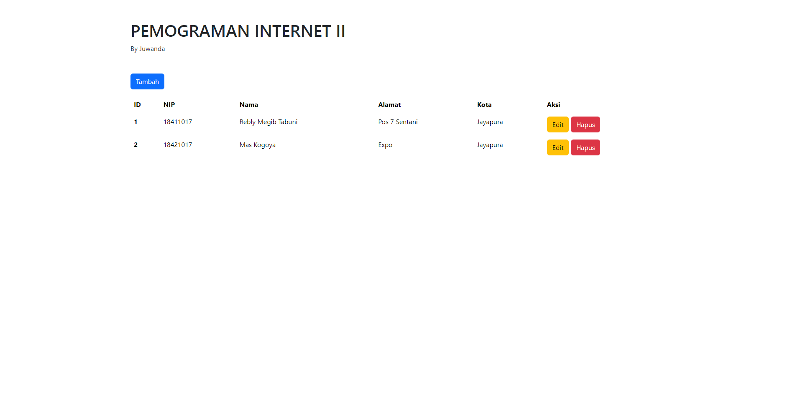
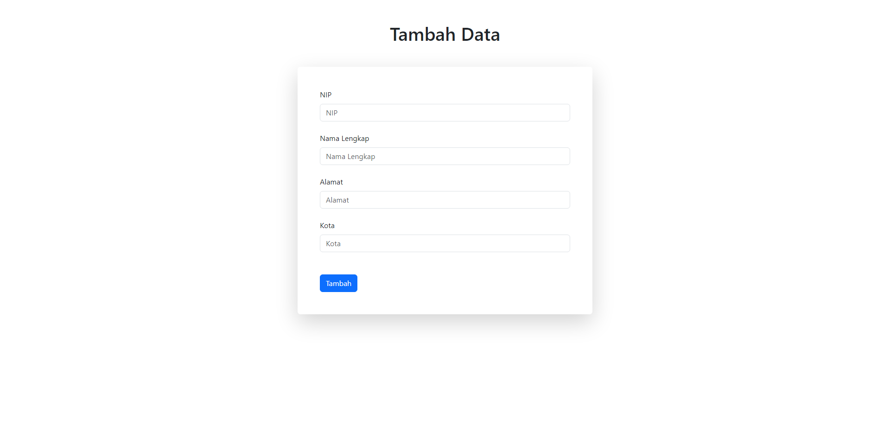
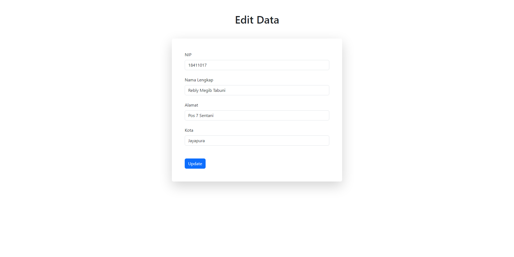

# Juwanda - UAS Pemrograman Internet 2

Proyek ini adalah aplikasi sederhana untuk mengelola data mahasiswa dengan menerapkan fungsi CRUD (Create, Read, Update, Delete) menggunakan HTML, Bootstrap, dan PHP Native.

## Fitur

- Menambahkan data mahasiswa
- Mengedit data mahasiswa
- Menghapus data mahasiswa

## Teknologi yang Digunakan

- HTML
- CSS (Bootstrap)
- PHP Native
- MySQL

## Tampilan

### Halaman Utama



### Form Tambah Mahasiswa



### Form Edit Mahasiswa



## Instalasi

Berikut adalah langkah-langkah untuk meng-clone dan menjalankan proyek ini di mesin lokal Anda:

### Prasyarat

- Web server (XAMPP, LAMP, WAMP, atau lainnya)
- PHP
- MySQL

### Langkah-langkah

1. **Clone repositori ini**

    ```bash
    git clone https://github.com/username/juwanda-uas-pemograman-internet-2.git
    ```

2. **Buat database di MySQL**

    Buat database baru dengan nama `testdb` (atau nama lain yang Anda inginkan) dan impor file SQL yang terdapat di dalam folder proyek untuk membuat tabel `mahasiswa`.

    ```sql
    CREATE DATABASE testdb;
    USE testdb;
    SOURCE path/to/your/sql/file.sql;
    ```

3. **Konfigurasi koneksi database**

    Perbarui file `konekdb.php` yang ada di folder `config` dengan kredensial database Anda.

    ```php
    <?php
    $localhost = "localhost";
    $user = "root";
    $password = "";
    $db = "testdb";

    $koneksi = mysqli_connect($localhost, $user, $password, $db);
    if (mysqli_connect_errno()) {
        echo "Gagal Koneksi ke database: " . mysqli_connect_error();
    }
    ?>
    ```

4. **Jalankan server lokal**

    Tempatkan proyek ini di dalam direktori `htdocs` (jika menggunakan XAMPP) atau direktori yang sesuai dengan konfigurasi web server Anda. Kemudian jalankan server lokal.

5. **Akses aplikasi**

    Buka browser dan akses aplikasi melalui URL berikut:

    ```url
    http://localhost/juwanda-uas-pemograman-internet-2/
    ```


## Penulis

- Anjas Tabuni

